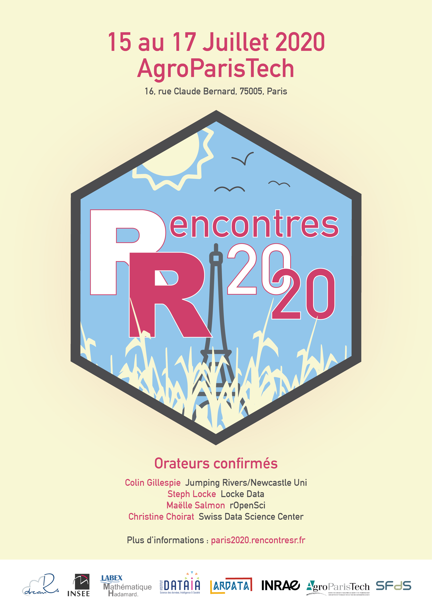

# Communication 

## Affiche

## Comptes twitter

Compte officiel :
<a href='https://twitter.com/rencontres_R'>@rencontres\_R</a>

### Comité d’organisation

  - Julien Chiquet :
    <a href='https://twitter.com/tchikets'>@tchikets</a>
  - Antoine Bichat :
    <a href='https://twitter.com/_abichat'>@\_abichat</a>
  - Mahendra Mariadassou :
    <a href='https://twitter.com/Mahendra_Maria'>@Mahendra\_Maria</a>
  - Marie-Pierre Etienne :
    <a href='https://twitter.com/Marie_Etienne'>@Marie\_Etienne</a>

### Comité de programme

  - Colin Fay :
<a href='https://twitter.com/_ColinFay'>@\_ColinFay</a>

### Conférenciers

TBA

<!-- * Colin Gillespie : <a href='https://twitter.com/csgillespie'>@csgillespie</a> -->

<!-- * Steph Locke : <a href='https://twitter.com/theStephLocke'>@theStephLocke</a> -->

<!-- * Maëlle Salmon : <a href='https://twitter.com/ma_salmon'>@ma_salmon</a> -->

<!-- * Christine Choirat : <a href='https://twitter.com/cchoirat'>@cchoirat</a> -->

<!-- * TBA -->

## Chartre graphique

### Couleurs

| Nom   | Nom complet            | Hexadécimal | RGB                |
| :---- | :--------------------- | :---------- | :----------------- |
| Gris  | Very dark grayish blue | \#4B4B4D    | rgb(75, 75, 77)    |
| Bleu  | Very soft blue         | \#92C6EB    | rgb(146, 198, 235) |
| Rouge | Moderate pink          | \#CE3F6A    | rgb(206, 63, 106)  |
| Beige | Light grayish yellow   | \#F7F4D3    | rgb(247, 244, 211) |

### Polices

  - DIN Altermate
