```{r setup, include=FALSE}
options(htmltools.dir.version = FALSE)
```

```{r icons-emojis, message=FALSE, echo=FALSE}
# remotes::install_github("ropenscilabs/icon")
# remotes::install_github("hadley/emo")
```

class: noslidenumber
background-image: url(libs_rr/sticker_rr.png)
background-size: 15%
background-position: right 20px bottom 20px

# Déroulement

### Amphithéâtre Tisserand

- Plénières, contributions, lightnings
- Un lien zoom unique sur les deux jours

### Amphithéâtre Risler

- Ateliers (lundi et mardi matin) + contributions (lundi et mardi après-midi)
- Un lien par ateliers + un lien zoom unique sur les deux jours

## Comment?

- présents: projection + échange orateur/trice
- distants: suivi + ineraction via zoom

---
class: noslidenumber

```{r, echo = FALSE}
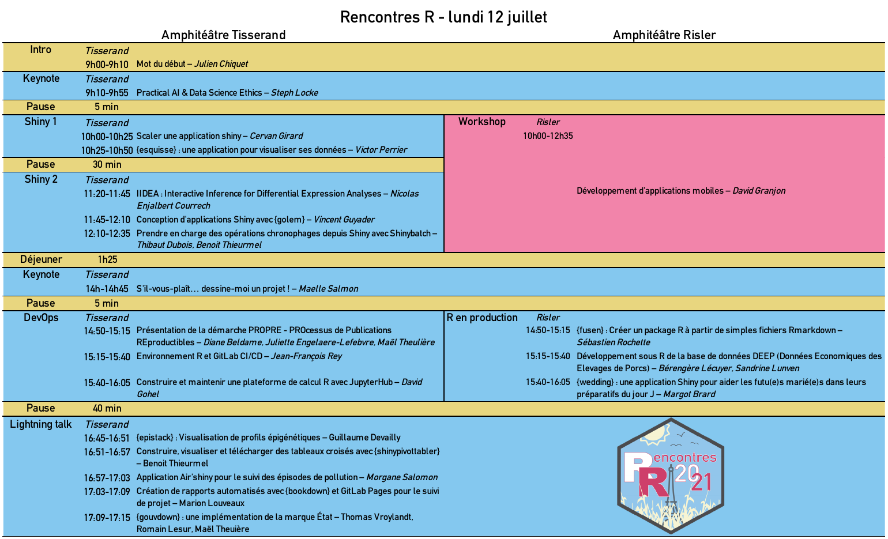
```

---
class: noslidenumber

```{r, echo = FALSE}
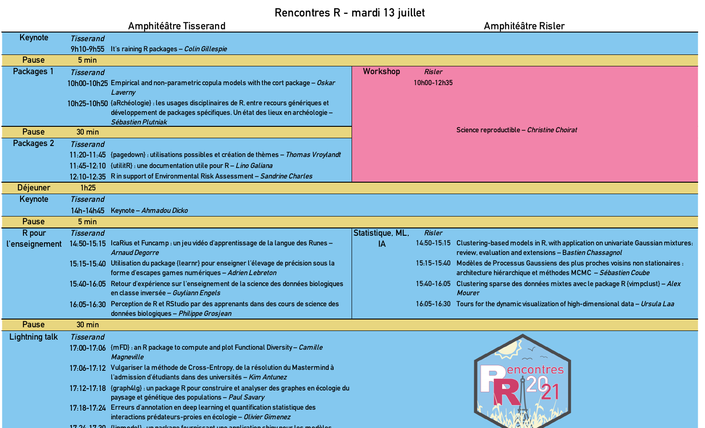
```

---
class: noslidenumber
background-image: url(libs_rr/sticker_rr.png)
background-size: 15%
background-position: right 20px bottom 20px

# Informations pratiques

## Repas & pauses

- un point de distribution (salle du centenaire, face tisserand)
- 4 espaces d'accueil pour 25 personnes maximaum

## Connexion internet

wifi: eduroam ou visiteurs, code .large[`dEka26sty6f`]

## Espaces de discussions

- Pauses, cour intérieure d'AgroParisTech
- Slack: [https://rencontresr2021.slack.com/](https://rencontresr2021.slack.com/)

---
class: noslidenumber
background-image: url(libs_rr/sticker_rr.png)
background-size: 15%
background-position: right 20px bottom 20px

# Partenaires

## Accueil gracieux


## Structure associative


---
class: noslidenumber

# Sponsors Or

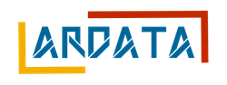 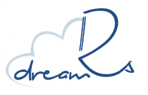 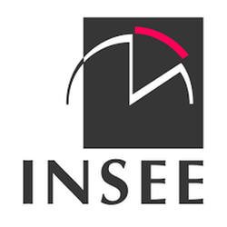 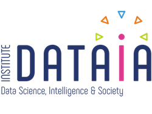 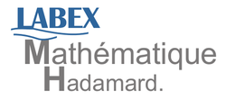

---
class: noslidenumber

# Sponsors Argent et Bronze

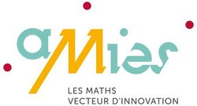  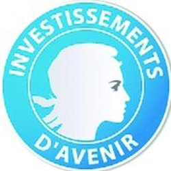 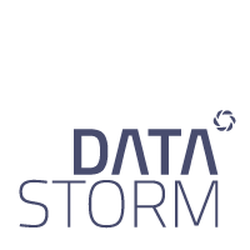 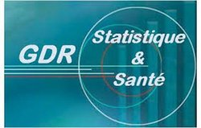 

---
class: noslidenumber
background-image: url(libs_rr/sticker_rr.png)
background-size: 15%
background-position: right 20px bottom 20px

# Comités

.pull-left[

## Programme

- Marie Chavant
- Christophe Dervieux
- Sophie Donnet
- **Colin Fay (président)**
- Nathalie Vialanex
- Romain Lesur
]

.pull-left[

## Organisation

- Julie Aubert
- Pierre Barbillon
- Antoine Bichat
- **Julien Chiquet (président)**
- Sophie Donnet
- Marie-Pierre Étienne
- Mahendra Mariadassou
- Tristan Mary-Huard
- Laure Sansonnet
- Jessica Tressou


]
